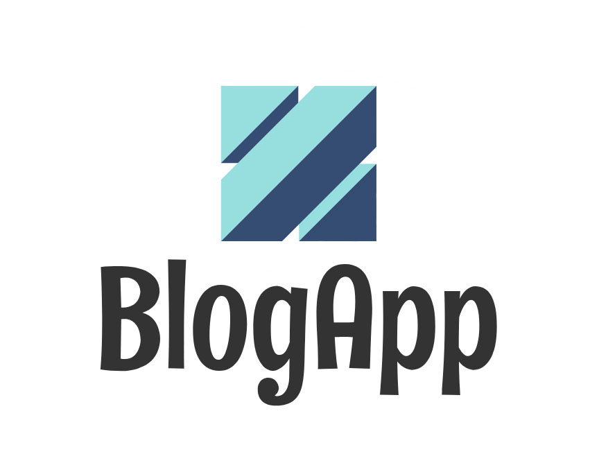
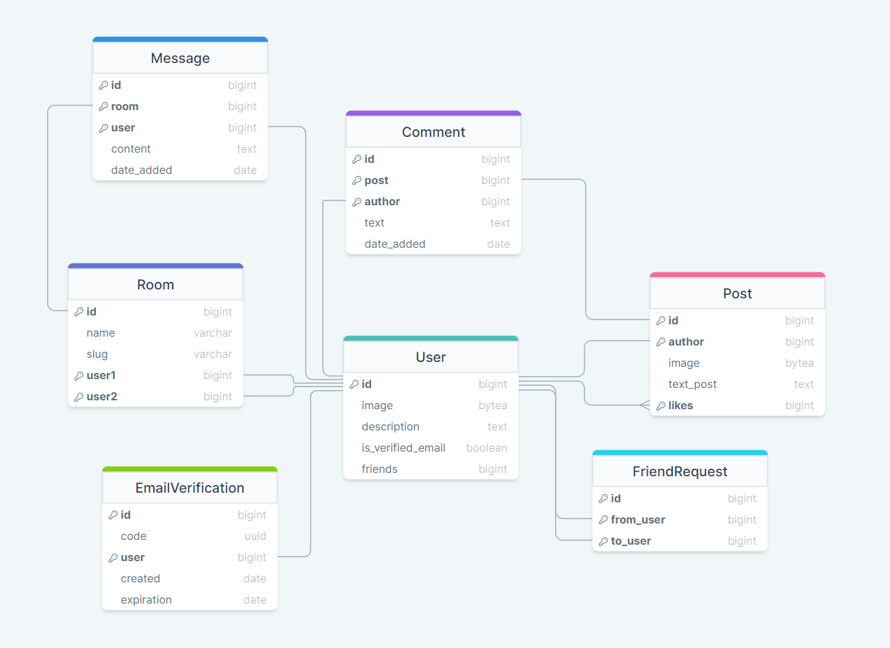
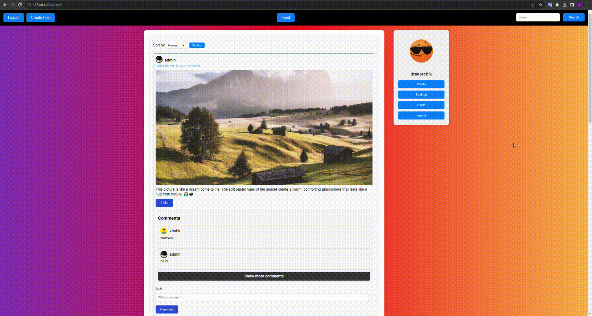
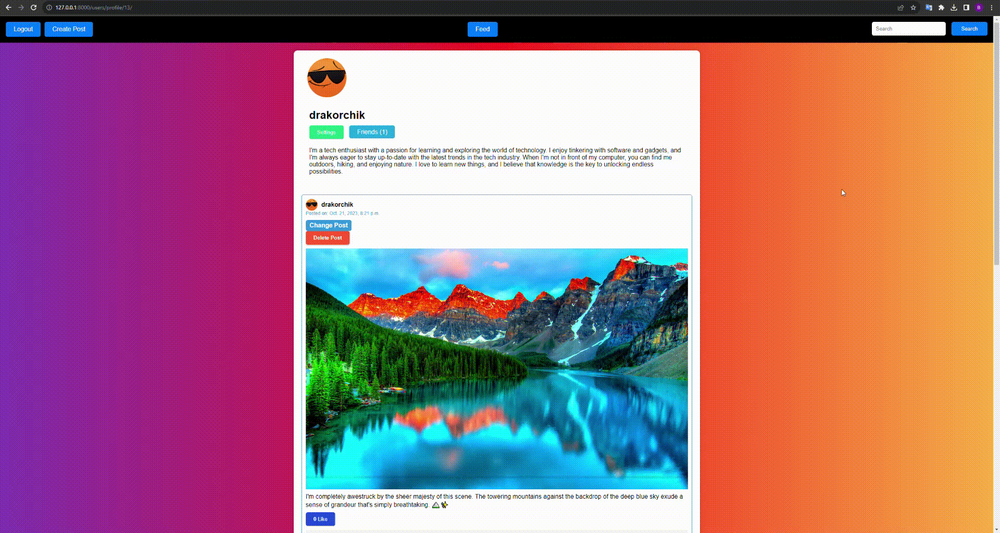
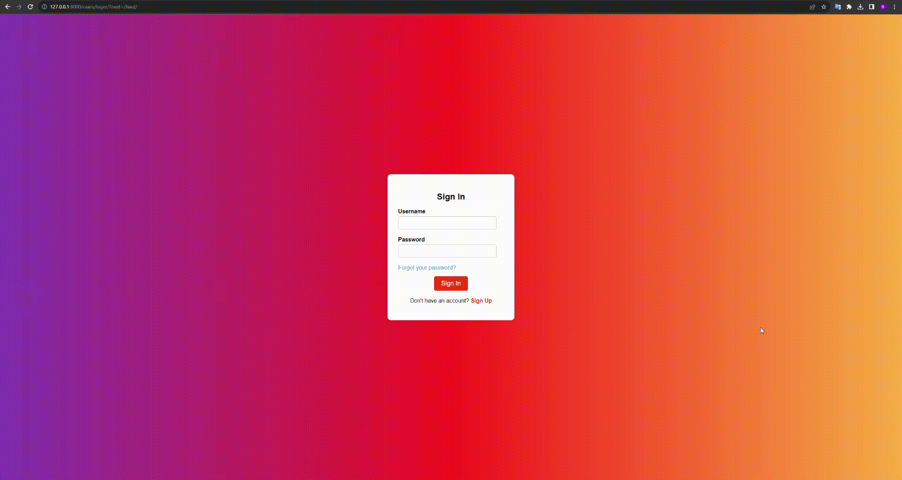
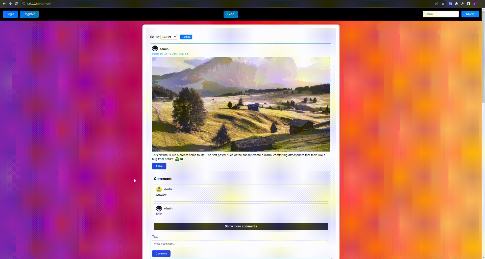

# BlogApp Website

This project was initiated for educational purposes, with the primary objective being 
to delve deeper into technologies such as Django, PostgreSQL, Celery, and especially 
Django Channels, WebSockets, and Docker.

## Technology Stack
* Python/Django/Django-ORM
* PostgreSQL
* Redis
* Celery
* Docker
* HTML/CSS

In this project we are using PostgreSQL as main Database, 
Redis for message broker, Celery for delayed tasks, Docker to container our project

# Database(PostgreSQL)

Our project has 7 self-written models, where especially the main one is User

# Celery/Redis
Celery was used for sending email verifications as delayed tasks to optimize this process.

# Django channels, Websocket
Our project focuses on creating a real-time online chat application using 
Django Channels and WebSockets. These technologies enable instant messaging 
and dynamic updates, making conversations lively and engaging. This project 
has sharpened our skills and opened doors to exciting possibilities in real-time 
web applications.

# Website Usage
## Feed page

On the feed page, we can see posts of other users, as well as our own. 
Users have the ability to comment on and like posts. Additionally, if it's 
an authorized user's post, they can edit or delete it.

On the right side of the feed, we have a sidebar where we can access our chats, 
go to our profile page, access settings, and log out.

We have sorting options on this page, allowing us to sort posts by alphabet and date.

Within each post, you can click on the user's nickname to visit their profile. 
Furthermore, if a post has more than two comments, there is a 'load more' 
button that allows us to view all the comments.

## Search

On all pages with a navbar, we can search for any profiles and posts.

## Create/Edit/Delete Post

We have two input fields in the create/edit post form: one for images 
and one for the post description.

Simply deleting the post if it's the authorized user's post.

## Login/Register

On the feed page and other pages, you can't comment, like, or add friends 
without logging in. Attempting these actions will redirect you to the login
page. If a user doesn't have an account, they can register, and then they need
to verify their email.

## Profile

On an authorized user's page, they can access settings and edit or delete their posts. 
On other users' pages, you can add them as friends and send them messages.

## Add/Delete Friend

On the profile page, there is an 'Add Friend' button. When a user clicks this button , 
a friend request is sent to the other user, who can choose to accept or reject it.
If the request is accepted and the user becomes friends, you can delete this user from 
your friends list.

## Chatting

On the profile page, you'll find a 'Message' button. When a user clicks on it,
the system checks whether they have an existing chat. If they do, it opens the existing
chat; otherwise, it creates a new chat. Users can engage in real-time conversations 
with each other, thanks to the implementation of WebSockets and Django Channels.

# Summary
This project represents a comprehensive exploration of web development using Django, 
encompassing a wide range of essential features and technologies. Through this journey, 
we delved into building a robust authentication system, enabling users to effortlessly 
sign in or sign up. Moreover, we embraced the power of third-party services like Gmail 
for user registration, offering a seamless onboarding experience. 

In addition, we leveraged Django Channels and WebSockets to implement a real-time 
chat feature, enhancing user engagement and interactivity. Our project primarily 
revolves around a blog, where we have integrated features such as adding friends, 
creating posts, and implementing a likes system to enrich the overall user experience.